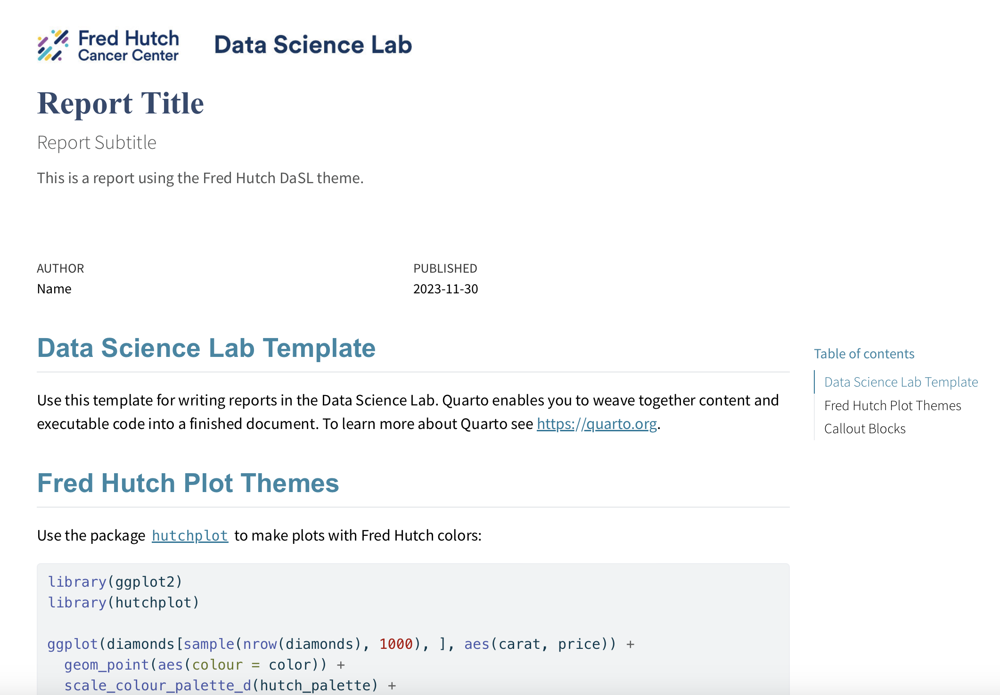

# DaSL Quarto Theme

A Quarto HTML report theme for the Fred Hutch Data Science Lab (DaSL).

Contributions for additional template formats (e.g. PDF) are welcome. See examples on the [Quarto Awesome repo](https://github.com/mcanouil/awesome-quarto#multiple-formats).

## Create a new report

You can use this as a template to create an HTML report.
To do this, use the following command:

```
quarto use template fhdsl/dasl-quarto
```

This will install the extension and create the `template.qmd` file that you can
use as a starting place for your report.

## Installation for an existing document

You may also use this format with an existing Quarto project or document.
From the quarto project or document directory, run the following command to
install this format:

```
quarto install extension fhdsl/dasl-quarto
```

Then add `format: dasl-html` to the quarto YAML header.

## Fred Hutch branding

This report uses CSS styling based on the Fred Hutch branding guidance 
available at <https://brand.fredhutch.org/>.


